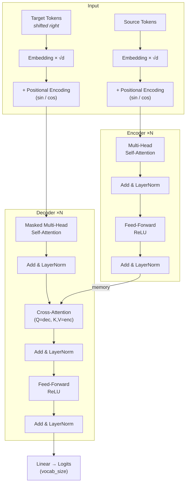

# Transformer (implement từ đầu)

Cấu trúc gói `transformer/` theo bài báo *Attention Is All You Need* (Vaswani et al., 2017).

## Kiến trúc Transformer

Mô hình theo kiến trúc **Encoder–Decoder** từ bài báo gốc *"Attention Is All You Need"* (Vaswani et al., 2017).



### Thành phần chính

| Thành phần | File | Mô tả |
|---|---|---|
| **Scaled Dot-Product Attention** | `attention.py` | `softmax(QK^T / √d_k) × V` — cốt lõi của cơ chế attention |
| **Multi-Head Attention** | `attention.py` | Chia `d_model` thành `H` head (mỗi head `d_k = d_model/H`), chạy attention song song rồi concat + project (`W_o`) |
| **Positional Encoding** | `positional_encoding.py` | Mã vị trí sin/cos cố định (không học), cộng trực tiếp vào embedding |
| **Feed-Forward Network** | `feed_forward.py` | Hai lớp tuyến tính với ReLU: `FFN(x) = ReLU(xW₁+b₁)W₂+b₂`, mở rộng lên `d_ff` rồi chiếu về `d_model` |
| **Encoder Layer** | `encoder_layer.py` | Self-Attention → Add & LayerNorm → FFN → Add & LayerNorm |
| **Decoder Layer** | `decoder_layer.py` | Masked Self-Attention → Add & Norm → Cross-Attention (K,V từ encoder) → Add & Norm → FFN → Add & Norm |
| **Masks** | `masks.py` | Padding mask `(B,1,1,L)` ẩn token pad; Causal mask (tam giác dưới) ngăn decoder nhìn tương lai |
| **Transformer** | `transformer.py` | Xếp chồng N encoder + N decoder layers, embedding, positional encoding, linear head |

### Hyperparams mặc định

| Param | Giá trị | Ý nghĩa |
|---|---|---|
| `d_model` | 512 | Chiều embedding / hidden |
| `num_heads` | 8 | Số attention head (`d_k = 64`) |
| `num_encoder_layers` | 6 | Số tầng encoder |
| `num_decoder_layers` | 6 | Số tầng decoder |
| `d_ff` | 2048 | Chiều ẩn trong FFN |
| `max_seq_len` | 512 | Độ dài tối đa sequence |
| `dropout` | 0.1 | Dropout toàn mô hình |

### Luồng dữ liệu

1. **Encode**: `src tokens` → Embedding × √d → + Positional Encoding → N × EncoderLayer → `memory`
2. **Decode**: `tgt tokens` → Embedding × √d → + Positional Encoding → N × DecoderLayer (nhận `memory` qua cross-attention) → Linear → `logits (B, tgt_len, vocab_size)`
3. **Masking**: Padding mask ẩn token `<pad>`; causal mask (kết hợp padding) đảm bảo autoregressive decoding.
4. **Init**: Tất cả tham số có `dim > 1` được khởi tạo Xavier Uniform.

## Thứ tự đọc code (học dần)

1. `transformer/attention.py` — scaled dot-product attention, multi-head.
2. `transformer/positional_encoding.py` — mã hóa vị trí sin/cos.
3. `transformer/feed_forward.py` — FFN từng vị trí.
4. `transformer/masks.py` — mask padding và causal (decoder).
5. `transformer/encoder_layer.py` / `decoder_layer.py` — một tầng encoder/decoder.
6. `transformer/transformer.py` — xếp chồng encoder + decoder + embedding.

## Chạy thử

```bash
cd Transformer
source .venv/bin/activate   # hoặc venv của bạn
pip install -r requirements.txt

python example_meaningful_sentences.py   # copy task với câu tiếng Việt
python train_reverse_task.py             # đảo ngược chuỗi
python train_sort_task.py                # sắp xếp tăng dần
```

Các script là **synthetic seq2seq task** để verify pipeline Transformer:

| Task | Khó hơn copy ở chỗ | Tín hiệu pipeline đúng |
|---|---|---|
| **Copy** (`example_meaningful_sentences.py`) | — (baseline) | Loss giảm, model "nhớ" lại câu trong corpus |
| **Reverse** (`train_reverse_task.py`) | Cross-attention phải attend ngược (vị trí cuối → đầu) | exact-match accuracy → ~1.0 |
| **Sort** (`train_sort_task.py`) | Không có alignment cố định src↔tgt; mỗi bước decoder phải "chọn" min chưa sinh | exact-match accuracy → ~1.0 (cần nhiều step hơn) |

Chỉnh `STEPS` / `LR` / `MAX_LEN` trong từng file để thử.

```bash
python -m pytest tests/test_shapes.py -q
```

## Import

```python
from transformer import Transformer, scaled_dot_product_attention
```
